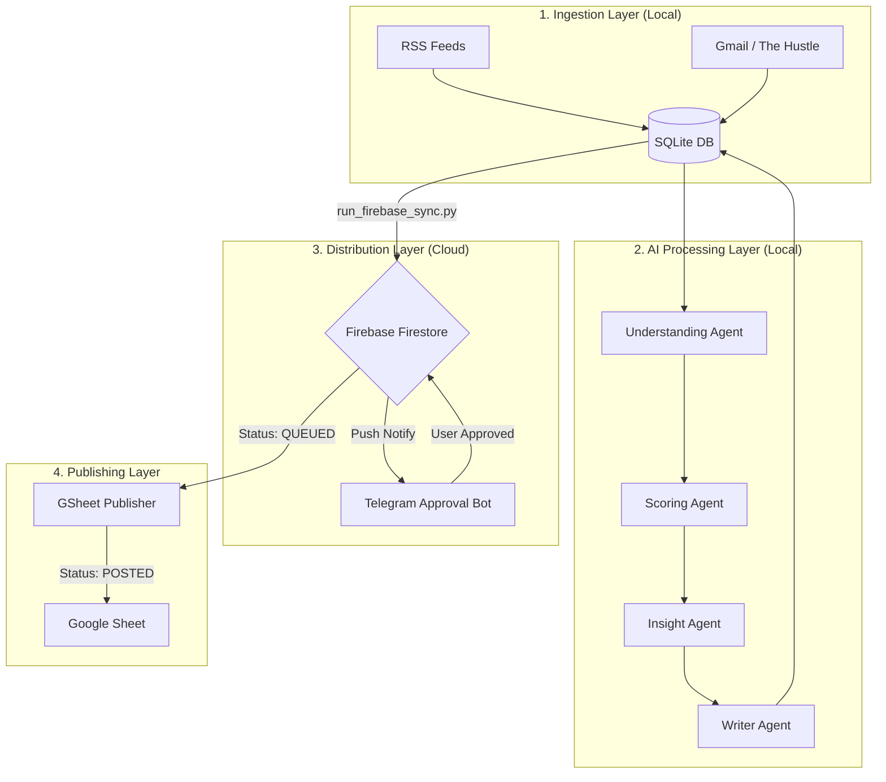

# Agentic AI: Strategic Content Pipeline 🤖💼

A high-performance, semi-automated intelligence and content distribution system. This platform monitors global tech/business trends, analyzes them using Generative AI, and orchestrates a multi-stage approval workflow from local processing to cloud distribution.

---

## 🏗️ System Architecture

---

## 🛠️ Technology Stack
- **Core:** Python 3.12+
- **Database:** SQLite (Local History) + Firebase Firestore (Cloud Distribution)
- **AI Models:** Gemini API (via LangChain/VertexAI patterns)
- **Communication:** Telegram Bot API (pyTelegramBotAPI)
- **Integrations:** Google Sheets API (gspread), Gmail API
- **Deployment:** Environment-driven (python-dotenv), Service Account Auth

---

## 🚦 Pipeline Execution Order

### Phase 1: Local Knowledge Extraction
1. **`python run_monitoring.py`**: Crawls 7+ sources (TechCrunch, Crunchbase, The Hustle, etc.).
2. **`python run_understanding.py`**: Performs deep semantic analysis and summarization.
3. **`python run_scoring.py`**: Filters for "Business Case Study" potential (0-100 score).
4. **`python run_insights.py`**: Extracted strategic market insights & lessons learned.
5. **`python run_writer.py`**: Generates high-conversion LinkedIn/Social post drafts.

### Phase 2: Cloud Syncing
- **`python firebase_publishing/run_firebase_sync.py`**: Offloads high-scored drafts from your local SQLite to the cloud Firestore.

### Phase 3: Human-in-the-loop Approval
- **`python telegram_approval/approval_bot.py`**: The background "Brain" that listens for your button clicks.
- **`python telegram_approval/push_daily_review.py`**: The "Trigger" that sends the best candidate to your phone.

### Phase 4: Final Fulfillment
- **`python google_sheets_publisher/gspread_publisher.py`**: Background worker that polls Firebase for `QUEUED` items and moves them to Google Sheets.

---

## 📁 Directory Structure & Module Details

| Module | Purpose |
| :--- | :--- |
| `monitoring/` | Houses source-specific crawlers and cleaners. |
| `agents/` | Generative AI logic for analysis, scoring, and writing. |
| `firebase_publishing/` | Handles local-to-cloud bridge logic. |
| `telegram_approval/` | Session management and interactive bot handlers. |
| `google_sheets_publisher/` | Automation for final spreadsheet fulfillment. |
| `data/` | Persistent local storage (`agent_registry.db`). |

---

## 💾 Database Schemas

### Local SQLite (`agent_registry.db`)
Stores raw crawl data to avoid duplicates and cache AI analysis.
- `articles`: url, title, content, published_at.
- `analysis`: score, summary, insight, final_post, status (DRAFT, WRITTEN).

### Cloud Firestore (`linkedin_posts`)
Synchronized staging area for external interfaces (Telegram/GSheets).
- `posting_status`: 
    - `NOT_POSTED`: Waiting for review.
    - `QUEUED`: Approved by you, waiting for GSheets worker.
    - `POSTED`: Finalized.
    - `REJECTED`: Filtered out.

---

## 🔐 Security & Deployment

### 1. Credentials Management
- **`.env`**: Private tokens (Telegram, Chat IDs).
- **`firebase_service_account.json`**: Cloud access.
- **`google_sheets_credentials.json`**: Drive/Sheet access.
- **`data/gmail/credentials.json`**: Email scope.

### 2. Production Deployment
To deploy to a server (VPS/Docker):
1. **PM2 Process Management**: Use PM2 to keep `approval_bot.py` and `gspread_publisher.py` alive 24/7.
2. **Cron Jobs**: Run the "Phase 1" local extraction scripts on a schedule (e.g., Daily at 8 AM).
3. **Volume Mapping**: Ensure `data/` is mapped to a persistent volume to keep article history.

---

## 🆘 Troubleshooting
- **Firebase 403**: Check if collection name in `firebase_config.py` matches your console.
- **GSheet 403**: Ensure the Service Account Email is added as **Editor** on the specific Sheet.
- **Telegram Timeout**: Ensure `approval_bot.py` is actually running locally to catch callback signals.
